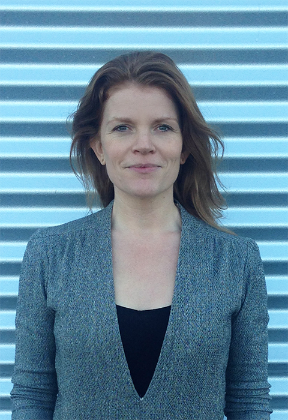

Structure of 2018-19
======================

# Material Driven Design

## Faculty
Mette Bak-Andersen and Thomas Duggan

## Syllabus and Learning Objectives
Since the industrial revolution profoundly changed and accelerated the way we make things, the relatively new design profession has been on a bumpy journey. It has been a trajectory that has taken us from traditional crafts where the designer and the maker were the same person, to a predominantly digital design process that is almost entirely based on concepts, form and theory and where the product development and fabrication are left in the hands of others.

But, making is back. Digital fabrication tools are engaging people in the process of designing and making physical objects in all parts of the world. Still, in the historical journey of design changing from analogue to digital and from the hands to the head, the in-depth knowledge of materials and how work with them, have been pushed out. This knowledge gap represents a major issue when designing sustainable physical objects (and in many other aspects). The main reason being that up to 80%of sustainability impacts are decided at the product design stage (Kulatunga et al., 2015; Lewis, Gertsakis, Grant, Morelli, & Sweatman, 2017). This effectively means that the designer is the creator of a recipe and will unavoidably make decisions that follow the product through its lifecycle. Therefore, the aim of this course is to bring the material dialogue which distinguished traditional craftsmanship back in to the contemporary design process.

Materials and fabrication have radically changed in complexity and numbers since the industrial revolution and the environment are on several parameters at a state of collapse, so the situation calls for a new approach to raw materials and manufacturing. This brings us in to a field defined by art, natural science and technology where designers manipulate, grow or develop the material for a product in the same process as designing form and function. This is also called Material Driven Design

## Total Duration
Classes: 60 hours

## Structure and Phases

### Thursday 24th January

Theory - Introductions to: Definition of sustainability and circular economy, alternative material ressources, the material dialogue from craft, embodied cognition.

### Friday 25th January

Working with the material dialogue in practice. Using wood and carving -in Valldaura.

### Thursday 31th January

Presentation of raw materials (Antropological and historical herritage, technical and experiential qualities, environmental impact).

### Friday 1th February

Theory - Phenomenological versus scientific method in material experimentation.

### Thursday 7th February

Remote consultations with Mette and Thomas (Students working on their own in the development a new material and a prototype of a product -if very large scale, then a section of the product).

### Friday 8th February

Remote consultations with Mette and Thomas.

### Thursday 14th February

Tutorials with Thomas + Remote consultations with Mette.

### Friday 15th February

Tutorials with Thomas + Remote consultations with Mette.

### Thursday 21th February

Final presentations.

##Output
A physical prototype of a product, made in the ‘real’ material as well as key material samples from the process.

A lab journal, documenting experiments in text and pictures and the final material recipe.

## Grading Method
Presentation 60% Documentation of process 40%

## Bibliography
Adamson, G. (2010). The craft reader Berg.

Bak-Andersen, M. (2018). When Matter Leads to Form: Material Driven Design for Sustainability. Temes de Disseny 34, 12-33

De los Rios, Irel Carolina, & Charnley, F. J. (2017). Skills and capabilities for a sustainable and circular economy: The changing role of design. Journal of Cleaner Production, 160, 109-122.

Ceschin, F., & Gaziulusoy, I. (2016). Evolution of design for sustainability: From product design to design for system innovations and transitions. Design Studies, 47, 118-163.

Fuchs, T. (2018). Ecology of the brain [Das Gehirn - ein Beziehungsorgan]. Oxford: Oxford University Press.

Kolbeinsson, A., & Lindblom, J. (2015). Mind the body: How embodied cognition matters in manufacturing. Procedia Manufacturing, 3, 5184-5191.

McDonough, W., & Braungart, M. (2010). Cradle to cradle: Remaking the way we make things MacMillan.

Reay, S., McCool, J., & Withell, A. (2011). Exploring the feasibility of cradle-to-cradle (product) design: Perspectives from new zealand scientists.

Vezzoli, C., & Manzini, E. (2008). Design for environmental sustainability Springer.

## Background Research Material

When Matter Leads to Form: Material Driven Design for Sustainability

The Circular Design Guide

KEA Material Design Lab

Doing Projects with Material Design Lab

## Requirements for the Students

Patience, curiosity and hard work….

## Mette Bak-Andersen

Mette Bak-Andersen is the founder of Material Design Lab at KEA, Copenhagen School of Design & Technology and a PhD Fellow at The Royal Danish Academy of Fine Arts, School of Design, KADK. She has a background as an industrial designer and has worked several years in the industry both in Barcelona and Copenhagen. Her research is situated in the cross-disciplinary field between art, natural science and technology and is focused on the relation between sustainability, material knowledge and the design process. Her ambition is to bring the material dialogue that is known from craft back into to the contemporary design process.

## Thomas Duggan

Thomas Duggan is an inventor who has a love of nature, design, materials, architecture, science, advanced generative design, technology, craft and robotic fabrication. His work chronicles explorations into design, sculpture, site-specific installations, engineering, architecture, material science, traditional craftsmanship and research. He studied at Central St. Martins, London, UDK, Berlin and TUFTS, USA. He is passionate about reconnecting people with the natural environment through design, art, bioengineering, architecture and sustainability. His work merges technical and functional to ethereal and mysterious. He has exhibited internationally at galleries such as the V&A London, Somerset House, London Design Festival, PS1, MoMA and the Salone Del Mobile. He has been collaborating with TUFTS, MIT, RCA, Harvard and Autodesk in recent years as well as developing his own practice.
