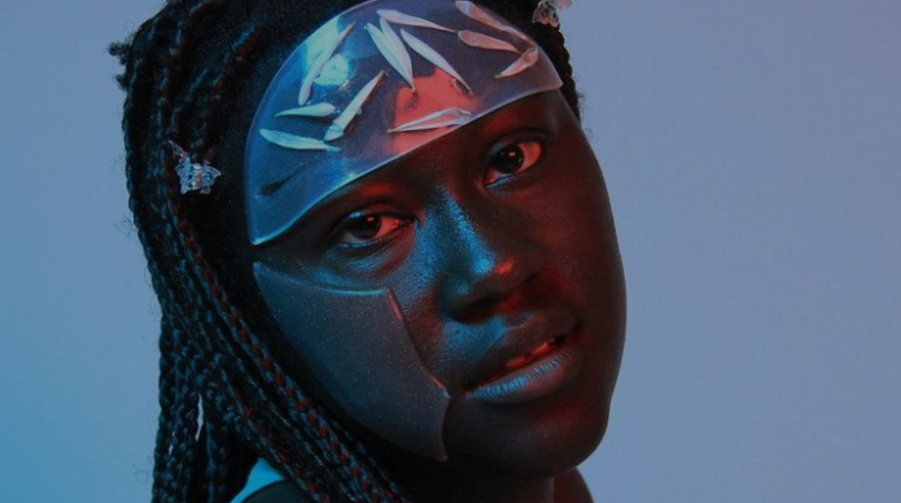

Structure of 2022-23
======================
# Communicating Ideas

## Track
Application

## Faculty
Kate Armstrong

## Syllabus

This course will explore various approaches to communicating design concepts and ideas to a variety of stakeholders. By the end of the seminar students will be confident in identifying, prioritising and reaching key stakeholders with appropriate communication tools. They will also be able to seek and identify opportunities to communicate their ideas through efficient and effective strategies.

## When  
24th January - 7th March 2023

## Schedule

**Session 1**: Who What Why

**Session 2**: When Where How

In Person.

## Deliverables / Outputs

- Text, device, image, poster, etc.
- TBC
- Students are requested to submit all the material requested by the faculty + their reflections about the seminar on the MDEF repository on GitLab.

## Link

<iframe src="https://drive.google.com/embeddedfolderview?id=1ChV9K7ZzacBq-3z7ZDxCqPcpuaFwOoG8" style="width:100%; height:100%; border:0;"></iframe>

[Open Drive folder](https://drive.google.com/drive/folders/1ChV9K7ZzacBq-3z7ZDxCqPcpuaFwOoG8){ .md-button .md-button--primary }

## Kate Armstrong

A Master Arts and Society (University Utrecht) and Bachelor of Design (UNSW), Kate has vast experience in cultural programming, design and open tech fields in Australia and Europe. She has been the communication and dissemination manager for various European research projects at Fab Lab Barcelona concerned with circular economy, open design innovation ecosystems and future cultural heritage. She managed the Distributed Design Platform, a Creative Europe Platform co-funded by the European Commission and currently serves as its strategic advisor. Kate sits on the Executive Board of the Fab City Foundation, as the global initiative’s Strategic Director. She is Faculty of the Master in Design for Emergent Futures at IAAC/ELISAVA, Faculty of the Master in Distributed Design and Innovation and Head of Programming for Interspecies Internet - a global think tank to accelerate interspecies communications.

Email Address (kate@fab.city)

Personal Website (https://www.linkedin.com/in/kate-armstrong/)
