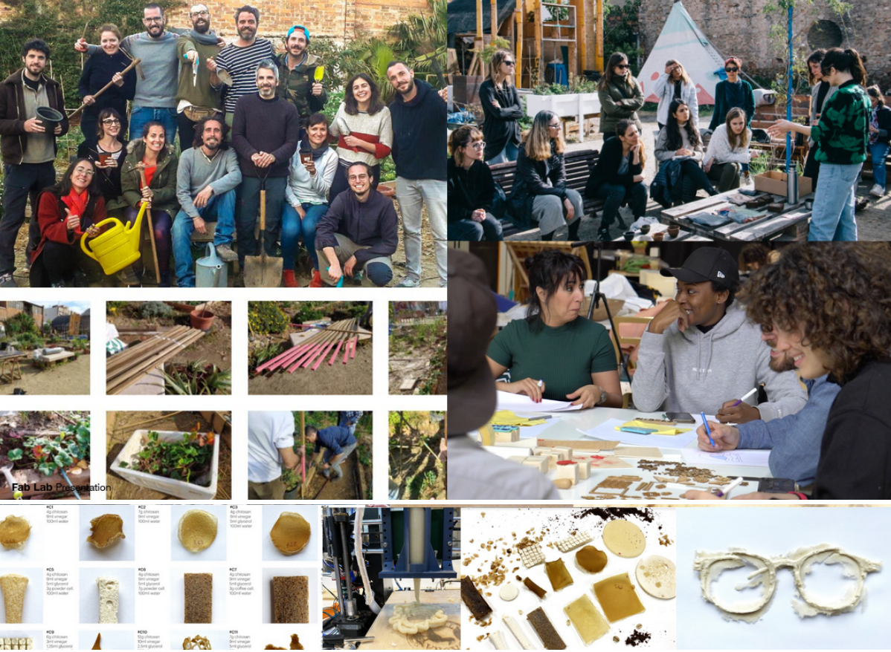

Structure of 2022-23
======================
#  Design Studio Term 2 2022-23
### Embodying Emergent Contexts

## Track
Application

## Faculty
Oscar Tomico & Mariana Quintero

## Syllabus

MDEF Research, Design and Development studios aim to take research areas of interest and initial project ideas into an advanced concretion point, and execution plan. The studio structure in three terms could be understood as follows:

TERM 1 Research: Understanding what it means to design for emergent futures. Analyzing the past and finding weak signals. References, state of the art. Identifying areas of interest. Experimenting from the first-person perspective.

TERM 2 Design: Forming the present through interventions in the real world. Building the foundations of your design space, forming strategic partnerships. Applying knowledge into practice through iterative prototyping. Testing ideas and prototypes in the real world.

TERM 3 Development: Refining interventions and identifying desirable futures. Establishing roadmaps for the construction of emergent narratives.. Communicating and disseminating your project through speculative design.

**The Second Term Design Studio** aims to refine the work developed by students during the first term of the Master program. After identifying areas of interest from weak signals in the first term, and creating their design space and first interventions, students will be encouraged to take a further step into their projects, focusing on finding and growing their communities of practice and developing interventions in the real world (digital or physical).

## When  
Monday's

## Schedule

### 09/01 Kick off - Reframing by reflecting on your project so far

**Goals:** Critically look back at your project, reflect on the feedback from the Design Dialogues, and propose a new scope, goals and next steps.

**Activity:** Briefly present in class 3 of the main learning points from the 1st trimester.

**Assignment:** Reflect on your and your project’s current stage of development allowing your project to talk back. Analyze your so-called “failures” as opportunities for redefining your frames of reference and repositioning yourself and your project accordingly.

**Deliverable:** An updated version of your design space. A 500 word text with a summary of your journey so far, adding the repositioning of yourself and your project.  Make explicit new project goals and next steps including a proposal for the 1st intervention of the second trimester (a draft will be discussed during the design reviews the week after).

### 16/01 Design Studio Reviews (individual)

### 23/01 A 1PP Design intervention in context. Look for your peers and communities. Analyze and make sense of a 1PP Design Action.

**Goals:** Understand yourself better as a design tool in contexts, learn how to properly document, analyze and make sense of a design action from a 1PP.  

**Activity 1:** Briefly present in class an updated version of the design space and a proposal for the 1st intervention of the second trimester.

**Activity 2:** Plan your first design intervention of the term and map the actors and infrastructure you want to involve.

**Task:** Carry out your 1st design intervention from a 1PP (involving yourself in the context you want to work on).

**Deliverable 1:** Document the 1PP design intervention, analyze it and reflect on the findings. Describe the alternative present scenario that this intervention is offering.

**Deliverable 2:** Update your design with the relations you have built.

### 30/01 Network of co-responsibility. (Co-)designing for emergent futures in the present. 	

**Goals:** Reflect on your network of co-responsibility.  Voicing others: A 1PP Design intervention in context giving the stage to your peers and communities (human and non-humans). Let the human and non-human actors be a driving force in your project.

**Activity:** Present your results from your 1PP design intervention. Reflect on how you can iterate this intervention, this time allowing others to take the lead.

**Task:** Plan and execute a 2nd design intervention, a collective design intervention with this perspective.

**Deliverable:** Document the 2nd collective design intervention, analyze it and reflect on the findings.

**Deliverable 2:** Update your design space with the relations you have built.

### 06/02 Design Studio Reviews with Fab Academy

### 13/02 Design Studio Reviews with Fab Academy

### 21/02 Radical Situatedness: Considering the resilience, material flows, situated knowledge and existing infrastructures of your interventions

**Goals:** Understand how your intervention can become resilient, taking into consideration self-sufficiency, locality and situated knowledges. Understand the agency of the environment you are working in.

**Activity 1:** Present your results from your 2nd design intervention.

**Activity 2:** Resilience Assessment. What is your project relying on?

**Task:** Plan and execute a 3nd design intervention, a collective design intervention with this perspective.

**Deliverable 1:** Document the final design intervention, analyze it and reflect on the findings. Describe the alternative present scenario that this intervention is offering.

**Deliverable 2:** Update your design space with the relations you have built.

### 27/02 Design Studio Reviews

### 06/03 Exploring alternative presents: Expanding the boundaries of your interventions.

**Goals:** Explore your biographies and analyze your way of drifting in order to make sense of the alternative present you are creating.

**Activity 1:** Present your results from your 3rd collective design intervention.

**Activity 2:** Analyze the evolution from your design spaces over the 3 iterations to reflect on your way of drifting to envision your future biography by means of an alternative present.

**Deliverable:** Map, visualize and analyze the evolution of your design space over the 3 iterations based on ways of drifting, create a narrative in relation to your alternative present.

### 13/3 Design Dialogues II Preparation

**Goals:** Create a collective and individual building up plan for the Design Dialogues exhibition.

**Activity:** Group dynamic to create themes and groups of projects for the exhibition.

**Deliverable:** Planning of the exhibition, space allocation and special needs.

**Task:** Work on the design dialogues deliverables.

###  22/03 Design Dialogues

## Deliverables / Outputs

2-5 min Video-Documentary (video-journaling) of your 3 Term II interventions - for presenting during Design Dialogues and for uploading to the Emergent Futures Community
Visual material to support the exhibition.
Evolution of physical and/or Digital prototypes from your Design Space
5 high resolution images of your interventions during the term
**Thesis Draft** - Chapters 4-8 made up of the weekly deliverables for this term. (Due until the end of Easter Holidays):
Chapter 4: Reframing of the project
Chapter 5: First Intervention: documentation, resulting alternative present, updated design space.
Chapter 6: Second Intervention: documentation, resulting alternative present, updated design space.
Chapter 7: Third Intervention: documentation, resulting alternative present, updated design space.
Chapter 8: Updated Vision and Identity (Future Talks Reflection)

## Link

<iframe src="https://drive.google.com/embeddedfolderview?id=1X9GEbtSMw0ajRftxLY_06jMA4OKEhe5e#list" style="width:100%; height:100%; border:0;"></iframe>

[Open Drive folder](https://drive.google.com/drive/folders/1X9GEbtSMw0ajRftxLY_06jMA4OKEhe5e){ .md-button .md-button--primary }

## Oscar Tomico

Oscar Tomico holds an MSc degree in Industrial Engineering from Polytechnic University of Catalonia (Spain) and a PhD from the same institution, awarded in 2007 with Cum Laude. During his research into Innovation Processes in Product Design, he investigated subjective experience-gathering techniques based on constructivist psychology. After finishing his PhD he worked as a consultant for Telefonica R&D (Barcelona). Tomico joined Eindhoven University of Technology (TU/e) in 2007 as Assistant Professor. He has been a guest researcher and lecturer at AUT Creative technologies (New Zealand), at TaiwanTech (Taiwan), Swedish School of Textiles (Sweden), Institute of Advanced Architecture (Spain), University of Tsukuba, Aalto (Finland) to name a few. During his sabbatical in 2015, he worked as a consultant for the functional textiles department at EURECAT (Spain). He recently (2017) became the head of the Industrial Design Bachelor’s degree program at ELISAVA University School of Design and Engineering of Barcelona.

<!--[Email](otomico@elisava.net)-->

[Personal Website](https://www.elisava.net/en/teaching-staff)

Twitter Account @otomico

## Mariana Quintero

Multimedia developer, interaction designer & researcher, Mariana Quintero works and develops her practice at the intersection where digital fabrication technologies, digital literacy, and information and computation ethics & aesthetics meet, contributing to projects that investigate how digital information and technologies translate, represent, and mediate knowledge about the world. She is currently a faculty member and part of the strategic team at the Masters in Design for Emergent Futures at IAAC | Fab Lab Barcelona

<!--[Email](mariana.quintero@iaac.net)-->

[Personal Website](https://mqvlm.github.io/)
