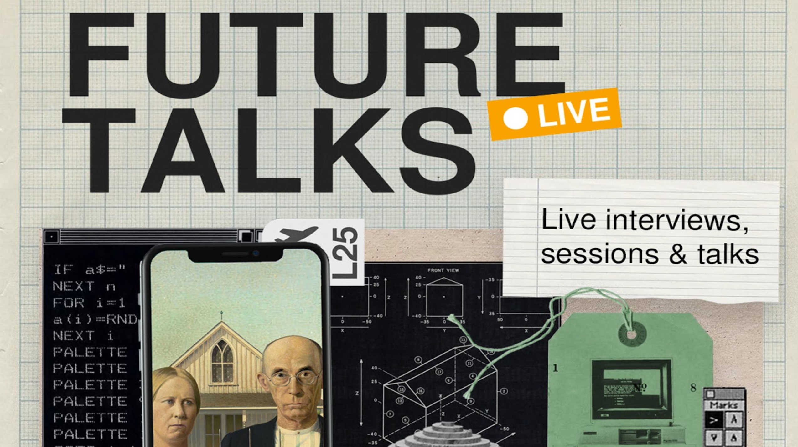

Structure of 2022-23
======================
# Future Talks

## Track
Future Talks is a series of conversations with friends of ELISAVA and Fab Lab Barcelona, exploring the nature of emerging futures from the past to the present and beyond.

## Faculty
Oscar Tomico & Mariana Quintero

## Syllabus

Future Talks is a series of conversations with friends of ELISAVA and Fab Lab Barcelona, exploring the nature of emerging futures from the past to the present and beyond.

Research has shown that most of the job opportunities and future challenges that will arise in the next few years still don’t exist. Instead of seeing it as a threat, we want you to look at it as an opportunity. An opportunity to actively create your own path, your own vision and identity rather than passively wait for what is needed.

In MDEF we believe that learning should be driven by your motivations and not by our (the teachers) thoughts. We want you to be in control of your own development especially in a master program full of activities. We want you to plan a strategic turn for yourself. We will provide you with a variety of knowledge, skills and attitudes to compare yourself with.

In this series of talks, critical reflection will help you to map your strengths and weaknesses in relation to the approach to design that the master is proposing. A series of presentations and visits to key professionals will make you aware about how your thinking, making, interests and values differ from others.

## When  
Every other Monday

## Schedule

### 09/01  Audrey Desjardines - Autobiographical Design - Approaching failure - Revealing Tensions in Autobiographical Design
http://audreydesjardins.com/

### 23/01 Laura Forlano - Auto-ethnography -
https://lauraforlano.org/

### 30/01 Fred Van Amstel - Monster Aesthetics
Federal University of Technology – Paraná (UTFPR)​
usabilidoido@gmail.com

### 20/02 (TBC)

## Deliverables / Outputs

At the end of this trimester we expect you to update who you are and what makes you unique (identity) and your personal “vision” of your future as a professional. Create a specific post on your website.

## Link

<iframe src="https://drive.google.com/embeddedfolderview?id=1X9GEbtSMw0ajRftxLY_06jMA4OKEhe5e#list" style="width:100%; height:100%; border:0;"></iframe>

[Open Drive folder](https://drive.google.com/drive/folders/1X9GEbtSMw0ajRftxLY_06jMA4OKEhe5e){ .md-button .md-button--primary }
