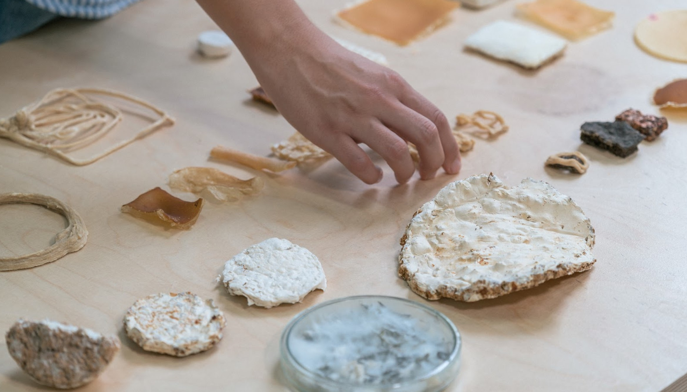
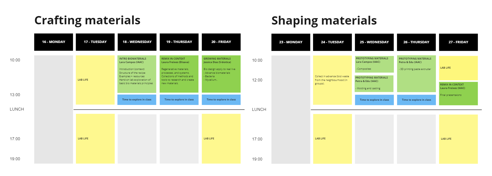

Structure of 2022-23
======================
# Remixing Materials

## Track
Application

## Faculty
Lara Campos, Laura Freixas, Petra Garajova and Eduardo Chamorro Martin

## Syllabus

This course will introduce students to the world of bio-based materials and upcycling, with a focus on hands-on exploration and prototyping. Students will learn about the principles of biomaterials, including how to grow and manipulate them, and will have the opportunity to prototype their own projects using a range of techniques such as composites, modeling and casting, and 3D printing.

For many years designers thought of materials as something to choose from a catalog, a patented formula developed in giant laboratories. However, our home kitchen offers tonnes of possibilities to start the design process from material sources such as waste and use systemic design practices to connect it with the local socio-economic context.

The course will also include a section on remixing in context, where students will learn how to connect their material choices and upcycling projects with the local socio-economic context.

## When  
Wednesday 18th to Friday 17th of February 23'

## Schedule

### CRAFRING MATERIALS

**Jan 18th.** INTRO BIOMATERIALS, Lara Campos. Location: IAAC. Guided (10:00 to 13:00), Autonomous (13:00 to 14:00)

**Jan 19th.** REMIX IN CONTEXT, Laura Freixes. Location: Elisava. Guided (10:00 to 13:00), Autonomous (13:00 to 14:00)

**Jan 20th.** GROWING MATERIALS, Jessica Dias. Location: S-biotic. Guided (10:00 to 13:00), Autonomous (13:00 to 14:00)

### SHAPING MATERIALS

**Jan 25th.** PROTOTYPING (Composites) , Lara Campos. Location: IAAC. Guided (10:00 to 12:00)

**Jan 25th.** PROTOTYPING (Modling and casting), Petra & Edu. Location: IAAC. Guided (12:00 to 14:00)

**Jan 26th.** PROTOTYPING (3D printing) , Petra & Edu. Location: IAAC. Guided (10:00 to 13:00), Autonomous (13:00 to 14:00)

**Jan 27th.** REMIX IN CONTEXT (Final presentations), Laura Freixes. Location: IAAC. Guided (12:00 to 14:00)

### MIRCOCHALLENGES

**Feb 14th.**  Lara Campos . Location: IAAC. Mentor session (13:00 to 14:00)

**Feb 17th.**  Lara Campos . Location: IAAC. Final presentation (16:00 to 17:00)

## Deliverables / Outputs

- Develop an understanding of the principles of biomaterials and the potential for using waste materials in upcycling projects.

- Understanding the potential for using locally sourced and waste materials in the design process, and the role of designers in connecting their work to the local socio-economic context.

- Explore a range of techniques for prototyping and manipulating bio-based materials.

- Connect material choices and upcycling projects with the local socio-economic context through the use of systemic design practices.

- Create and present a final project that demonstrates the use of bio-based materials and upcycling techniques.

## Link

<iframe src="https://drive.google.com/embeddedfolderview?id=1ChV9K7ZzacBq-3z7ZDxCqPcpuaFwOoG8" style="width:100%; height:100%; border:0;"></iframe>

[Open Drive folder](https://drive.google.com/drive/folders/1ChV9K7ZzacBq-3z7ZDxCqPcpuaFwOoG8){ .md-button .md-button--primary }
