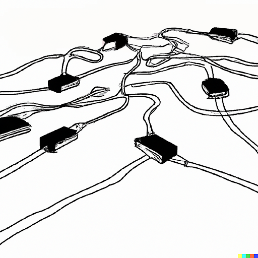
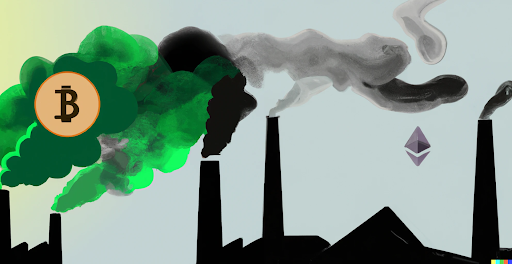
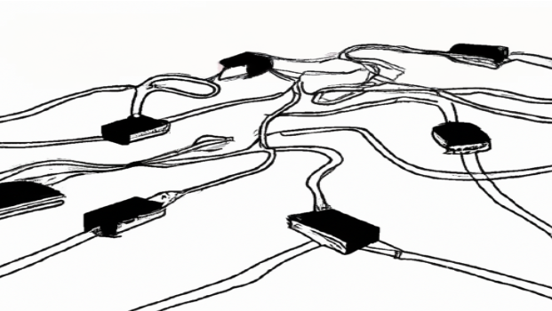
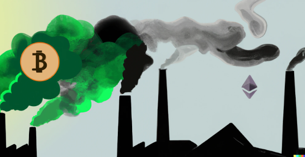

Structure of 2022-23
========

#  Collective Intelligence

## Track
Refelction

## Faculty
Mar Canet, Guillem Camprodon

## Syllabus

<<<<<<< HEAD
This course will examine the ways in which emerging technologies can empower individuals and promote a more coherent society. Through the lens of blockchain, cryptography, and decentralized autonomous organizations (DAOs), students will explore how these technologies can promote collective decision-making and reduce power imbalances on today's digital platforms. By examining the history and development of Bitcoin, Ethereum and Tezos, as well as the emergence of NFTs, students will gain a deeper understanding of the social and ethical implications of emerging technologies.
​​
## Learning Objectives

•	Understand the potential impact of blockchain and cryptocurrency on society, including the implications for governance, finance, and social systems.

•	Explore the principles of cryptography and decentralized technologies, including the role of smart contracts and decentralized autonomous organizations (DAOs).

•	Analyze the potential advantages and disadvantages of decentralized systems, including their ability to promote collective decision-making and reduce power imbalances.

•	Develop skills in critical thinking and evaluation, as well as an understanding of the social and ethical implications of emerging technologies.
=======
This course will examine the ways in which emerging technologies can empower individuals and promote a more coherent society. Through the lens of blockchain, cryptography, and decentralized autonomous organizations (DAOs), students will explore how these technologies can promote collective decision-making and reduce power imbalances on today's digital platforms. By examining the history and development of Ethereum and Bitcoin, as well as the emergence of NFTs, students will gain a deeper understanding of the social and ethical implications of emerging technologies.
>>>>>>> b7c496e1b1343521d1459462b179de6d813f27c0

## Learning Objectives

- Understand the potential impact of blockchain and cryptocurrency on society, including the implications for governance, finance, and social systems.
- Explore the principles of cryptography and decentralized technologies, including the role of smart contracts and decentralized autonomous organizations (DAOs).
- Analyze the potential advantages and disadvantages of decentralized systems, including their ability to promote collective decision-making and reduce power imbalances.
- Develop skills in critical thinking and evaluation, as well as an understanding of the social and ethical implications of emerging technologies.
- Apply course concepts to real-world case studies, including examples of decentralized platforms, NFTs, and initiatives that promote collective control.
- Engage in hands-on activities to build skills in blockchain and cryptocurrency, including designing and deploying smart contracts and participating in DAOs.
- Collaborate with peers to develop and present proposals for decentralized systems that address real-world challenges.

<<<<<<< HEAD

=======

image.png

>>>>>>> b7c496e1b1343521d1459462b179de6d813f27c0

## Total Duration
The course duration is a total of 12 hours of guided workshop time, spanned along two weeks.

## Classes

**May 4th** – Thursday (10:00 to 13:00), Guillem Camprodón

**May 10th** – Wednesday (10:00 to 13:00), Mar Canet

**May 11th** – Thursday (10:00 to 13:00), Mar Canet

**May 12th** – Friday (10:00 to 13:00), Mar Canet

## Structure and Phases

The course will use the MDEF room at P102 and the FabLab Educational room to access tools and other space necessities. A big screen (proyector/tv) will be used for both students and teachers presentations.

The Communication department will provide equipment and team support on the last days of the workshop to asses the student on videography and filmmaking techniques.

## Materials Needs

All materials needed for the course will be provided by the faculty. The students are required to bring to the classes their laptop, their own students toolkit and the programming boards given to them at the start of the academic year, other development boards, sensors and actuators will be provided during the workshop.

### Requirements for Students
Softwares to be installed, material, specific knowledge, etc.
It is required to have a laptop.
We will use Temple wallet software for Tezos: https://templewallet.com/

## Deliverables / Outputs

Student will develop a project during the workshop that will be presented on Friday and can improve and send a final version 1 week after the workshop,19th May.  The project can range from a NFT collection, to a white paper or presentation of an idea for a project using web3 (like a DAO or new cryptocurrency or any other idea that connects to the topics cover in the course).  
<<<<<<< HEAD

Students are requested to submit all the material requested by the faculty + their reflections about the seminar on the MDEF repository on GitLab https://mdef.iaac.net/ within a maximum of 1 week after the students’ submission deadline.

=======

Students are requested to submit all the material requested by the faculty + their reflections about the seminar on the MDEF repository on GitLab https://mdef.iaac.net/ within a maximum of 1 week after the students’ submission deadline.
>>>>>>> b7c496e1b1343521d1459462b179de6d813f27c0

## Grading Method

The projects submitted will be graded base on:

- Participation in the course: 20%
- Originality idea: 40%
- Creative use of technology: 30%
- Friday Presentation: 10%

Students who submit after the deadlines defined by the faculty and coordination will be subject to penalty and the grade will be automatically lowered. Incomplete submission is considered a missing submission. T

## Bibliography and Background Research Material

### Books

- Artists Re:Thinking The Blockchain. ed. Ruth Catlow, Marc Garrett, Sam Skinner and Nathan Jones published by Torque and Furtherfield (2017)
https://torquetorque.net/wp-content/uploads/ArtistsReThinkingTheBlockchain.pdf

### Papers

- NFT Shop and Making Sense of the NFT Art Market. Is NFT a blessing or a curse to digital art? Varvara Guljajeva and Mar Canet Sola
https://drive.google.com/file/d/1l1M404OWKQwI6pbADM3MyRHBnEvuYt_Y/view?usp=share_link

- Bitcoin: A Peer-to-Peer Electronic Cash System. 2008. Satoshi Nakamoto
https://www.ussc.gov/sites/default/files/pdf/training/annual-national-training-seminar/2018/Emerging_Tech_Bitcoin_Crypto.pdf

- Botto: A Decentralized Autonomous Artist 2022
https://neuripscreativityworkshop.github.io/2022/papers/ml4cd2022_paper13.pdf

### Articles

- Are Your NFTs Safe? How to Protect Digital Assets From Disaster
https://decrypt.co/138676/are-your-nfts-safe-how-to-protect-digital-assets-from-disaster?amp=1

## Bibliography and Background Research Material

### Books

Artists Re:Thinking The Blockchain. ed. Ruth Catlow, Marc Garrett, Sam Skinner and Nathan Jones published by Torque and Furtherfield (2017)
https://torquetorque.net/wp-content/uploads/ArtistsReThinkingTheBlockchain.pdf

### Papers

NFT Shop and Making Sense of the NFT Art Market. Is NFT a blessing or a curse to digital art? Varvara Guljajeva and Mar Canet Sola
https://drive.google.com/file/d/1l1M404OWKQwI6pbADM3MyRHBnEvuYt_Y/view?usp=share_link

Bitcoin: A Peer-to-Peer Electronic Cash System. 2008. Satoshi Nakamoto
https://www.ussc.gov/sites/default/files/pdf/training/annual-national-training-seminar/2018/Emerging_Tech_Bitcoin_Crypto.pdf

Botto: A Decentralized Autonomous Artist 2022
https://neuripscreativityworkshop.github.io/2022/papers/ml4cd2022_paper13.pdf

### Articles

Are Your NFTs Safe? How to Protect Digital Assets From Disaster
https://decrypt.co/138676/are-your-nfts-safe-how-to-protect-digital-assets-from-disaster?amp=1

LACMA Has Acquired a Who’s Who of Blockchain Art by Important Generative Artists
https://www.artnews.com/art-news/news/lacma-acquires-generative-art-nfts-art-blocks-1234657137/
LACMA Acquires a Spate of Generative Art NFTs – ARTnews.com
The Centre Pompidou in the age of NFTs
https://www.centrepompidou.fr/en/magazine/article/the-centre-pompidou-in-the-age-of-nfts

Ahead of Its Reopening, Buffalo AKG Art Museum Rolls Out Its First Online Exhibition Dedicated to NFT Art
https://news.artnet.com/market/buffalo-akg-art-museum-feral-file-peer-to-peer-nft-blockchain-art-exhibition-2216427

A guide to ecofriendly CryptoArt (NFTs)
https://github.com/memo/eco-nft

Interviews
‘I Have Sold More Than $30 Million in NFTs’: Iconoclastic Digital Artist Refik Anadol in Conversation With Collector Adam Lindemann
https://news.artnet.com/art-world/refik-anadol-adam-lindemann-conversation-2288481

Requirements for Students
Softwares to be installed, material, specific knowledge, etc.

It is required to have a laptop.
We will use Temple wallet software for Tezos: https://templewallet.com/
=======
- LACMA Has Acquired a Who’s Who of Blockchain Art by Important Generative Artists
https://www.artnews.com/art-news/news/lacma-acquires-generative-art-nfts-art-blocks-1234657137/

- The Centre Pompidou in the age of NFTs
https://www.centrepompidou.fr/en/magazine/article/the-centre-pompidou-in-the-age-of-nfts
>>>>>>> b7c496e1b1343521d1459462b179de6d813f27c0

- Ahead of Its Reopening, Buffalo AKG Art Museum Rolls Out Its First Online Exhibition Dedicated to NFT Art
https://news.artnet.com/market/buffalo-akg-art-museum-feral-file-peer-to-peer-nft-blockchain-art-exhibition-2216427

- A guide to ecofriendly CryptoArt (NFTs)
https://github.com/memo/eco-nft

### Interviews
- ‘I Have Sold More Than $30 Million in NFTs’: Iconoclastic Digital Artist Refik Anadol in Conversation With Collector Adam Lindemann
https://news.artnet.com/art-world/refik-anadol-adam-lindemann-conversation-2288481

## Mar Canet

Mar (born in Barcelona) is PhD candidate in BFM at Tallinn University and a research fellow at Cudan Open Lab. He has two degrees: in art and design from ESDI in Barcelona and in computer game development from University Central Lancashire in UK. He also has gained a master’s degree from Interface Cultures at the University of Art and Design Linz. In addition to that, Mar is a co-founder of Derivart and Lummo.

Email Address - mar.canet@gmail.com

### Links
- https://var-mar.info/
- https://www.linkedin.com/in/mar-canet-sola-6b4aa26/

## Guillem Camprodon

Guillem Camprodon is a designer and technologist working on projects bridging emergent technologies and grassroots communities. He is the director of Fab Lab Barcelona, the first Fab Lab in the European Union and a benchmark in the network of over 1800 Fab Labs. Over the last ten years, he helped scale Fab Lab Barcelona from a digital fabrication facility into an established research and innovation laboratory. He led Smart Citizen, a platform that opposes the traditional top-down Smart City model, empowering communities with tools to understand their environment. Guillem worked as a researcher on many European-funded projects, including Making Sense, iSCAPE, GROW Observatory, Organicity, DECODE, ROMI, or Reflow. He is also a lecturer in multiple IAAC programs, primarily at the Master on Design For Emergent Futures (MDEF).

Email Address - guillem@iaac.net

<<<<<<< HEAD
Links

https://www.linkedin.com/in/guillemcamprodon/

https://www.linkedin.com/in/guillemcamprodon/
=======
### Links
- https://www.linkedin.com/in/guillemcamprodon/
>>>>>>> b7c496e1b1343521d1459462b179de6d813f27c0
