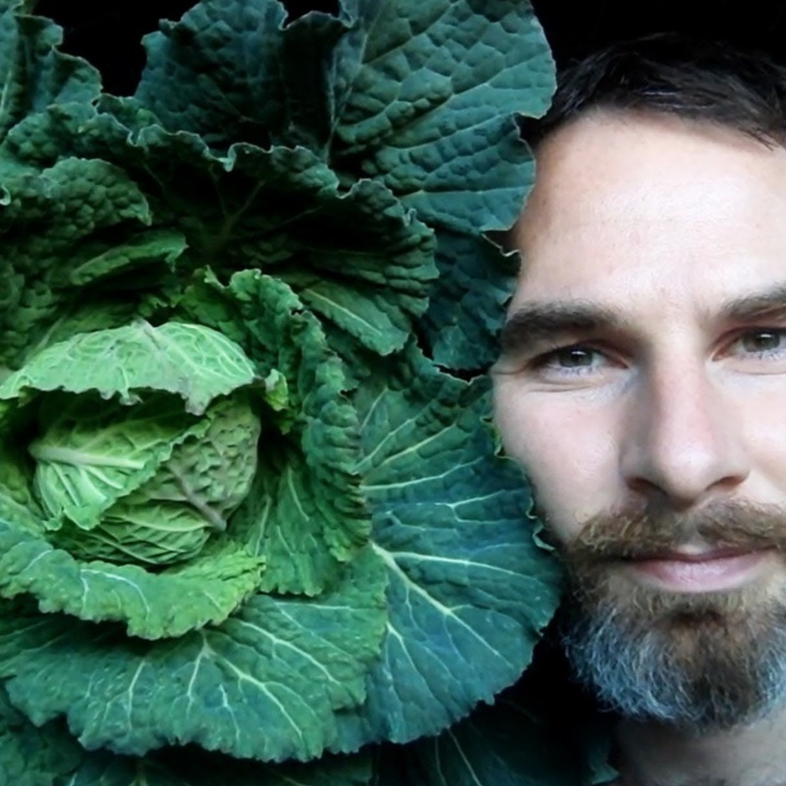

Structure of 2018-19
======================

#Biology Zero

## Faculty
Dr.Nuria Conde and Jonathan Minchin

## Syllabus and Learning Objectives
The recent growth of the international DIY-Bio / I-GEM and Bio Hackers networks are born of a motivation to narrow the golf between research conducted in institutional and corporate settings and to redirect the scientific locus back towards citizen scientists. The agenda of democratising access to the sciences is shared with that of libre software and open source electronics and maker movements. Access to the means experimentation for the investigative and applied sciences will not only change the way we understand and describe the world but also bring forth new knowledge, designs and engineering practises previously constrained to larger scale operations.

Through the course, researchers will learn how to identify microorganisms, how to take samples and prepare cultivation medias, how to observe microscopic organisms and to obtain amplify DNA and analyse it. Researchers will be introduced to scientific concepts such as sterility, metabolism, genome, synthetic biology, biochemistry and microbiology. Gaining the ability to make creative decisions and construct logical frameworks for study and production in the field of biology.

## Structure and Phases

**D1 Theory** : Introduction - Facilities and Biological Distinctions Theory : Lab Safety, sterility and Scientific Method Practical : Setting up a sterile environment Practical : Experiments and field experiments

**D2 Theory** : Basics of Micro biology Theory : Introduction to Microbiology Practical : Identifying Biota Practical : Dying cultivated bacteria

**D3 Theory** : Basic concepts Theory : Metabolisms Practical : Preparing Liquid Media - Spirulina Practical : CaCo quantification and / Spectrophotometry

**D4 Theory** : Genes, DNA, Nucleotides Theory : Bio Technology tales / Micro organism factories Practical : Extraction and purification of DNA Practical : Preparing and using a PCR machine

**D5 Visit** : PRBB research facility Design : Experiment of own making

## Output
1- Students will design and hand-in their own notebooks in an innovative research fashion

2- A designed experiment following scientific methods will also be delivered

## Grading Method
70 % Creativity of Notes

20 % Research extent

10 % Experiment Design Method

## Bibliography
[Regenesis](http://www.regenesisthebook.com/)

## Background Research Material

[IGEM](http://igem.org/Main_Page)

[DIY Bio](https://diybio.org/)

[Academany Bio](http://bio.academany.org/classes.html)

## Requirements for the Students
Open PCR

Mac / Linux : Terminal

Your own DNA

## Nuria Conde

Nuria is a post-doctoral researcher at Complex Systems Laboratory at Universitat Pompeu Fabra (UPF) in the PRBB. She holds a major in Biology and engineering in informatics and performed her research thesis about Biocomputation, which is at the interface of both fields. Nuria teaches biology for architects, artists, and designers of IAAC, Elisava, or Massana universities and is a founder member of the DIYBioBcn, the first biohacking group of Spain.

<!-- [Email Address](nuriacondepueyo@gmail.com) -->

## Jonathan Minchin

MSC in ‘International Cooperation, Sustainable Emergency Architecture’ 2010, has worked with development projects alongside Habitat for Humanity - Costa Rica, UNESCO - Cuba, Basic Initiative - Tunisia, and with UN Habitat in Barcelona. He began the Green Fab Lab at IAAC Valldaura Labs campus in Barcelona in 2013, engaging the ‘Fab Academy’ and ‘Bio Academy’ programs. His ongoing projects include Open Source Beehives (OSBH), Robotics for Micro Farms (ROMI), the Zero Series circular economy workshops, and OpenLab.org.
