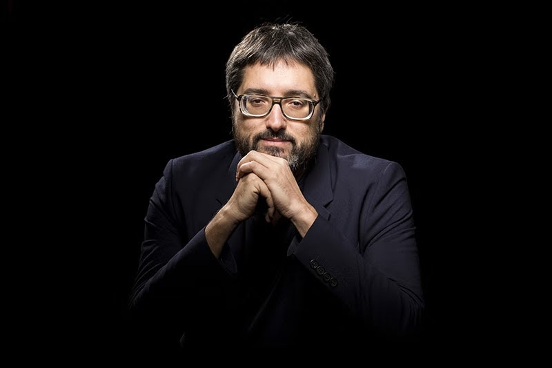

Structure of 2019-20
======================

# Atlas of Weak Signals - Introduction

## Faculty
José Luís de Vicente and Mariana Quintero   

## Syllabus and Learning Objectives
Every future scenario is built by detecting “weak signals” that set trends and point to certain directions, based on the analysis of the main change factors we can detect in the present. And the present for 2019 is a convulsed place, subjected to immense systemic crises that generate doubts about the survival of the status quo in multiple spheres.

Thus, any cartography we use for understanding the present requires an analysis of the main crises that determine our collective future. Towards the end of the 21st century, these include at least an ecological crisis that is the background for all other crises, a crisis of neoliberalism as the economic regime that has articulated the group of developed nations for the last 40 years, multiple crises of sovereignty and representation, a crisis of the discourses that grew with the digital utopias, a crisis of the productive model and the nature of work, a crisis of the cultural and social hegemony of privileged groups that are overrepresented in politics, culture or business, and last but not least, a migratory crisis of those who escape from all other crises, in a world in which economic, political and climatic refugees multiply. These vectors, and some others, define the territory in which we build our collective projects and our hopes for collective development.

As a transversal and ongoing project of the Masters in Design for Emergent Futures, the Atlas of the Weak Signals presents a space and a structure in which to navigate and position ourselves in this complex panorama, allowing for students and faculty to find design and intervention contexts and opportunities.

From these vectors, this seminar presents stories, narratives, proposals and images that allow the construction of an Atlas of Weak Signs for the design of Futures.

## Atlas of the Weak Signals: Intro

The seminar itself will be structured in stages, being the goal of this first one to give the students a general overview of the 25 current Signals that constitute the ongoing Atlas, a showcase of the research projects developed by former students and research faculty, and finally, a glimpse into a specific context which offers a hiper-local view of some of the vectors of the Atlas.

## Total Duration

Classes: 15 hours

## Structure and Phases

Session 1 will be dedicated to present a general introduction to the topics of the Atlas of the Weak Signals. The introduction will be given as a seminar by Jose Luis de Vicente, Senior Faculty of the course.

Session 2 will be dedicated to present the state of the work developed by former students and faculty, with a showcase of some of the best projects developed in the past year, as well as a selection of relevant research projects developed by IAAC and ELISAVA’s research groups within the topics of the Atlas.

Session 3 will be dedicated to a practical methodology in which the students will be encouraged to start positioning themselves and their research interests within the intersections of the Atlas, investigating how and in which intersection their areas of interests and projects stand.

Session 4 will present a special guest to help us transition down from a global view of the Atlas to the case study of a specific context: Cuba. Ernesto Oroza, cuban artist and designer, will approach some of the weak signals contemplated in the Atlas from the perspective of his expertise and work within the cuban context.
Ernesto Oroza

And finally Session 5, as a closure to this first introductory week, will be closed by a methodology lead also by Oroza in which students will explore the topics presented throughout the week, being challenged to speculate and project possible future scenarios and interventions that take into consideration global vectors as well as hiper-local challenges and realities.

Later in the academic year during Term II, the course will have the follow-up of this introductory course with the in-depth seminar that will investigate each one of the signals, guiding the students deeper into their selected intersections and areas of interests.

## Output

Once the course ends, each one of the students is expected to write an individual post reflecting on the journey we took during the week. You will elaborate on what you take from this course trying to answer the main question on where your research interests and possible intervention stand: Which of the weak signals that we identified and discussed during the week are personally more interesting to you and your project as areas of research? Which do you feel that particularly have an impact on you and your future? Why? Due date for this final deliverable will be 1 week after the course finishes.

## Grading Method

Participation and attendance during the week: 30%.

Final submission: 70%.

## Mariana Quintero

Multimedia developer, interaction designer & researcher, Mariana Quintero works and develops her practice at the intersection where digital fabrication technologies, digital literacy, and information and computation ethics & aesthetics meet, contributing to projects that investigate how digital information and technologies translate, represent, and mediate knowledge about the world. She is currently a faculty member and part of the strategic team at the Masters in Design for Emergent Futures at IAAC | Fab Lab Barcelona

Email Address mariana.quintero@iaac.net

Personal Website (https://mqvlm.github.io/)

## Jose Luis de Vicente

Jose Luis de Vicente is a cultural researcher and curator working in the space between the arts, technology, and innovation. Since 2012 he has been an associated curator for FutureEverything. He is the curator of Sónar +D, the digital culture and creative technologies conference and exhibition part of Barcelona’s acclaimed Sónar Festival. In the last 15 years, he has developed multiple exhibition projects, including the internationally touring show “Big Bang Data” (CCCB Barcelona, Somerset House London, Art Science Museum Singapore, MIT Museum, Cambridge) and more recently, “After the End of the World” (CCCB Barcelona, FACT-Bluecoat-Riba Liverpool).

Recent projects include Tentacular, a brand new festival of Critical Tech and Digital Adventures for Matadero (Madrid), and the curation of the 2019 edition of Llum BCN, Barcelona’s light festival. He was a founder of the Visualizar Program for Data Culture (Medialab Prado, Madrid) and is a faculty member at IaaC (Catalonia’s Institute for Advanced Architecture).
