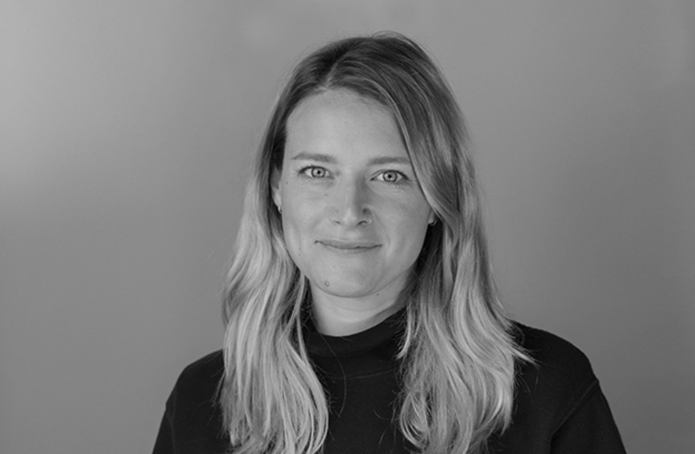

Structure of 2019-20
========

# Narrating Emergent Futures

## Track
Application

## Faculty
Kate Armstrong + Big Happiness team

Mariana Quintero

Santiago Fuentemilla + FLU team   

## Syllabus and Learning Objectives
“The destiny of the world is determined less by the battles that are lost and won than by the stories it loves and believes in.“ Harold Clarke Goddard

In this studio, students will explore the impact storytelling has had and continues to have in shaping the world around us. By critically understanding how narratives have shaped the past, students will gain a practical understanding of how to shape their own communications as designers of emergent futures.

Focusing on the communications and documentation styles which will be required of students during the course, we will explore issues of representation, hermeneutics, language and semiotics in the age of hyper-personalisation and post-truth. The studio will help students to navigate the vernacular of Maker Culture and will introduce them to how and why we communicate with machines. The studio will challenge students to critically engage with the layer of intangible culture they create as designers of emergent futures; to make meaning and to situate their practice in the cultural discourse.

## Total Duration
**15 - 18pm Mon-Fri**
Students can attend an out-of-studio-hours prep class of the 15th of October 12 - 14.00 to troubleshoot the installation of Git on their laptop. These hours are included in their student work hours. Students must have Git correctly installed by Wednesday 16th October. It can be tricky so please start the process early!
Here you can find documentation on installing Git Plus some helpful documentation from Silicon Valley Or you can search youtube or phone a friend.

## Structure and Phases

- Class 1 - Presentation: Our socio-cultural context - Monday

- Class 2 - Presentation: Personal representation - Tuesday

- Class 3 - Presentation and workshop: Why Git? - Wednesday

- Class 4 - Digital Identity - Thursday

- Class 5 - Putting it together: Make a Website - Friday

## Output

The design for a personal website

Personal statement

## Grading Method

70% Presentation

30% Documentation

## Background Research Material

Students can start checking out some awesome texts:

No Logo - Naomi Klein

This Changes Everything - Naomi Klein

The Myth Gap - Alex Evans

The Great Hack doco on Netflix

Walter Benjamin: The Work of Art in the Age of Mechanical Reproduction (1935)

Theodore Adorno: Culture Industry Reconsidered.

Jacques Derrida

The Century of the Self - Part 1: “Happiness Machines”

## Kate Armstrong

Kate is the communications lead at Fab Lab Barcelona where she also articulates the community and communications of the Fab City Global Initiative. An Australian design and business management undergraduate, Kate has worked in both the public and private sector of the creative field in the Netherlands and Australia on campaigns concerned with community engagement and audience development for social amelioration.

Studying a Master of Arts and Society at Utrecht University, she developed her research interest in the causality between the creative industries and climate change. As a freelance consultant Kate has created content and interventions with TEDx Sydney; Trivago; Vivid Festival at Museum of Contemporary Art Sydney; and BioPak Australia, New Zealand and United Kingdom.
