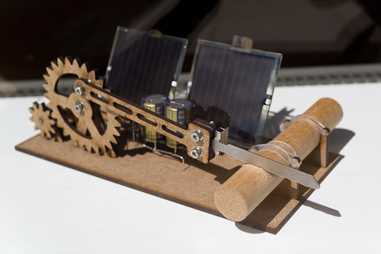

Structure of 2019-20
======================

# TThe Almost Useful Machines

description: Educational one week class on design mechanism to create Almost Useful Artifacts/MACHINES Week - (TAUM) Autor's: Eduardo Chamorro, Santiago Fuentemilla —

**tags: MDEF FLU Future Learning Unit Fab Lab Barcelona**

## Faculty
Santi Fuentemilla, Xavi Dominguez, Eduardo Chamorro, Mikel Llobera, Oscar Gonzalez and Julie Mallet

## Syllabus and Learning Objectives

Fab Labs and advanced manufacturing infrastructure are making accessible for any citizen to make anything anywhere while sharing it with global networks of knowledge, which allows accelerating design, development, and deployment processes for new products to be born. Traditional planning and urbanism are being disrupted by the acceleration of technology and the dynamic transformation of society during the last half-century; it is important to rethink how we make things and why, and generate active and practical conversations through projects and prototypes that become manifests itself.

 [TAUMs](https://hackmd.io/TdLbzvcbTrm8HG6xkYFNeg#The-Almost-Useful-Machines-Weeks---TAUMs) is a practical and intensive two-weeks experimental program into fabrication and introduction to the Fab Lab environment. It has been designed to fill knowledge gaps and aimed to prepare students to succeed and improve their experience during Fab Academy.

We will be going over the basic skills needed to design, develop, and fabricate almost anything in a Fab Lab, as well as how to manage time and resources necessary for its proper operation.

Our active learning methodology is based on the practice and **spiral development**, designed to encourage the creativity and imagination of the participants, as well as stimulate the search for tools and solutions for their correct definition.

We will offer an impact experience, seeking to inspire and motivate the participants to use the possibilities of digital manufacturing and technologies to prototype, design, fabricate and program **an “honest” mechanical artifact that “makes” something.**

## USELESS MACHINES
As existential purity, building a machine that doesn´t have a clear purpose as fabricating something or solve world problems allows the designer to focus on mechanics and movements allowing more freedom to really simplify actuation forgetting about constraints.

The metaphor of machines and artefacts doing endless predefined or random movements is what we call Useless Machines.

*Students will develop and fabricate something that is a mess of contradictions and wonderfulness.*

<iframe width="718" height="404" src="https://www.youtube.com/embed/2-iqu1EOcyo" title="Minimalist Marble Machine" frameborder="0" allow="accelerometer; autoplay; clipboard-write; encrypted-media; gyroscope; picture-in-picture; web-share" allowfullscreen></iframe>

## Context
It has been a long tradition among philosophers and writers to praise uselessness as a means to stress the importance of spiritual activities and creations without clear functional aims. Aristotle, for one, established early on that knowledge was valuable in itself, not for providing practical utility—a notion frequently forgotten today. To praise in utility, thus, has been a reaction to the materialistic values promoted by capitalist society, which has been criticized for its lack of moral and spiritual values.

Because machines are generally associated with the fulfilment of a practical duty, the functional independence of art is particularly highlighted when artists create or represent machines. We find ultimate examples of useless art machines in Wim Delvoye’s pursuit of technologically sophisticated devices for the production of excrement, or in Roxy Paine’s machines to fabricate art, which we can consider two times “useless”: for being artworks and for producing more art.

## Schedule

#### Total Duration

Classes: Mon-Thu (15 per week)

Student work hours: Mon-Thursday (13 per week)

Total hours per student: 28 hours

Presentation: Thursday From 13 to 14h.

### Calendar

#### Monday

**Morning session 10h(sharp)to 14h**

10:00 - 11:00 -> Introduction + Artifacts prototype DEMO + Q&A

11:00 - 11:30 -> Group formation

Skills start

11:30 - 12:30 -> GROUP WORKING Design brainstorming

Output: 2 ideas + references

12:30 - 13:30 -> CONTINUOUS REVIEWs Design brainstorming (Tutors goinng group by group)

13:30 - 14:00 -> Conclusions and group ideas presentation(sharing concepts)

**Afternoon session 15-19h**

15:00 - 17:00 -> GROUP WORKING First prototypes

17:00 - 19:00 -> CONTINUOUS REVIEWs Fabrication an materializing methodology (by tutors)

### Tuesday

**Morning session 10h(sharp)to 14h**

10:00 - 10:30 -> From Design to Replicability

10:30 - 14:00 -> GROUP WORKING v0.0 Artifacts fabrication

**Afternoon session 15-19h**

15:00 - 16:00 -> CONTINUOUS REVIEWs Fabrication/mechatronics/electronics (by tutors)

16:00 - 19:00 -> GROUP WORKING v1.0 Artifacts fabrication

### Wednesday

**Morning session 10h(sharp)to 14h**

10:00 - 11:30 -> Troubleshooting (by tutors)

11:30 - 14:00 -> GROUP WORKING Final production of artifacts V2.0

**Afternoon session 15-19h**

15:00 - 19:00 -> Final artifacts V2.0 and videoshoot of working prototypes,pictures,final presentation start

### Thursday - Final day

**Morning session 10h(sharp)to 14h**

10:00 - 12:00 -> Videoshoot of working prototypes,pictures,final presentation and video/media editing.

12:00 - 14:00 -> Artifacts presentation

14:00 - 15:00 -> Learning Dimensions

**Design principles**

“Honest” mechanical artifact, All the element must be seen accounted for “INTEGRATIVE"
Build on top of hacked parts
Maximize useless with the minimum amount of elements, minimalism

## Output

“Honest” mechanical artifact (1 input and/or 1 outputs + 2 differents fabrication process)

## Evaluation

Reflection (post): 5%

Conceptualitzation (From ideas to artifacts): 30%

Assistance: 10%

Involvement (individual): 10%

Presentation (slides and videos): 40%

If it does not explode: 5%

## Materials and resources

**Techniques** - Laser Cutter - 3d Printing - CNC machining - Recycling - Hand tools - Welding - Soldering

### Materials

- Arduinos unos (max 2 per group)

- Basic set of sensors

- Distance

- Light

- Sound

- Touch

- Magnetic

- Button

- Temp/humidity

- Basic set of actuators

- Steppers(max 1 per group)

- Servos

- DC motors

- Water/air pumps

- Electromagnet

- Relay

- LED

- Each team will have a power supply 12v 10amp

- 1x Wood 12-15(based on availability)1200x1200mm max

- 1x Wood or acrylic 3-5mmm 800x600mm max

- Cables

[Background Research Material](https://hackmd.io/TdLbzvcbTrm8HG6xkYFNeg#Background-Research-Material)

## Working methodology
The whole class will be divided in groups of 4 people. Each team will present a **ARTIFACT** at the end of the course.

## Presentation Requirements

- Video at minimum 1080p stabilized (not hand held recordings, use a tripod if you don´t know how to stabilize by software)

- Black or white background.

- Open source music matching the artifacts(properly acknowledged).

- Five photography's of the artefacts at high res.

- Ideally the sound produced by the machine will be also recorded in the video.

- Entry and finish titles with Team names, name of the artifact and Iaac/FablabBCN - Flu Logos.

- Min 10 slides presentation on:

  - How you designed it

  - What is suppose to do or not to do.

  - How you fabricate it

  - Accomplishments/failures

- All the documentation needs to specify what part of the project was developed by each team member.

## Goals

- Maximize useless with the minimum amount of hardware

- Minimalism is key word

- Visually attractive machine

- All the element must be seen accounted for “INTEGRATIVE DESIGN”

## Grading Method

Documentation, 40%

Involvement(individual): 20% include fill the form

Presentation: 35%

If it does not explode: 5%

## Background Research Material

MDEF-FABLAB CRASH COURSE

From Bits to Atoms 2018-19

Fab Academy

Fab Foundation

Fab Academy BCN

Fab Zero

Daniel Armengol Altayo

Machines that Make

Designing Reality

Reference Books

Make: The Maker’s Manual: A Practical Guide to the New Industrial Revolution

The 3D Printing Handbook: Technologies, design and applications

Fab: The Coming Revolution on Your Desktop - from Personal Computers to Personal Fabrication

## Grouping

**Estrella de habilidades**

Electronics

Programming

Design and CAD

Fabrication

## Santiago Fuentemilla Garriga

Santiago Fuentemilla Garriga (male), with Master of Architecture from the
University of la Salle Universitat Ramon LLull , Spain, as a specialist in
Architectural Design and Construction. In 2012 he graduated from the Fab
Academy Diploma at FabLab BCN, a digital fabrication and rapid prototyping
course directed by Neil Gershenfeld at MIT ́s Center For Bits and Atoms (CBA).
Currently, he is undertaking a PHD in digital fabrication processes at the EGA
UPC (Universitat Politecnica de Catalunya). As a professional Santi has worked in
various architectural firms carrying out projects at the international level in the
last 10 years. He is currently the design director at OPR (Other people’s Rooms)
in Barcelona, a multidisciplinary studio based on architectural concept design for
enhanced user experiences.

Since 2013 he is part of the Fab Lab BCN team, he is the coordinator of the
Future Learning Unit (FLU), the unit focused on the design, implementation and
coordination of active learning experiences with digital manufacturing tools for
the community. FLU designs and promotes educational, innovation and
entrepreneurship projects such as AmbMakers POPUPLAB "Digital Fabrication
Everywhere", FABKIDS, CROCOPOI. FLU participates in European research
projects such as DOIT or DSISCALE and PHALABS 4.0.

Since 2014 he is Fab Instructor of the global academic program Fab Academy
and since 2017 he is professor of the Master in Design for Emergent Futures
MDEF organized by IAAC.

## Guillem Camprodon

Guillem Camprodon is a designer and technologist working on projects bridging emergent technologies and grassroots communities. He is the director of Fab Lab Barcelona, the first Fab Lab in the European Union and a benchmark in the network of over 1800 Fab Labs. Over the last ten years, he helped scale Fab Lab Barcelona from a digital fabrication facility into an established research and innovation laboratory. He led Smart Citizen, a platform that opposes the traditional top-down Smart City model, empowering communities with tools to understand their environment. Guillem worked as a researcher on many European-funded projects, including Making Sense, iSCAPE, GROW Observatory, Organicity, DECODE, ROMI, or Reflow. He is also a lecturer in multiple IAAC programs, primarily at the Master on Design For Emergent Futures (MDEF).

## Víctor Barberán Soler

Víctor Barberán is an Industrial Designer with more than 20 years of experience developing custom technology for multidisciplinary art and science projects. Throughout his career, Victor Barberán has worked in electronics design, software development, data analysis, modelling and animation, and digital postproduction. Currently, Victor works as part of the Fab Lab Barcelona as a software and hardware developer in multiple research projects, such as the Smart Citizen project. He is also the Electronics lead for the Fabricademy, Fab Academy and the Masters of Design for Emergent Futures program.

## Eduardo Chamorro Martin

Eduardo Chamorro is an architectural technologist, additive manufacturing expert and researcher, focusing on digital fabrication, materials, robotics and emerging technologies.

He is currently a PhD candidate at Swinburne University (Melbourne, Australia) in High performance composites additive manufacturing for architecture.

Works as faculty and researcher at FabLab Barcelona & IAAC (Institute for Advanced Architecture of Catalonia) in Barcelona, Spain as faculty in the Master in Design for Emergent Futures (MDEF), Master for Advanced Architecture (MAA), Master in Advanced Ecological Buildings (MAEB), 3D Printing in Architecture (3DPA), FabAcademy at IAAC FabLab Barcelona. For him, working in a multi-scalar environment must be the priority of architects nowadays. His research focuses on the implementation of additive manufacturing technologies along different architectural scales imaging multiple processes and materialities.

Eduardo holds a Master's Degree in Architecture from CEU San Pablo University (Spain), a Fab Academy diploma in Digital Fabrication offered by the Fab Lab Network and a Master's Degree in Advanced Architecture from IAAC (Spain), with a specialisation in digital fabrication, materiality novel design methodologies. He holds as well a Spanish architectural licence.

Moreover, he has worked as Fab Lab Seoul director, researcher at several architecture studios, professor of computational design and fabrication at CEU University and advisor for various architecture collectives. He is also a regular collaborator at Fab Lab Madrid. He is always seeking innovative architecture that attempts to solve and adapt to social needs. He has also been a tutor for the Master of Science in Computational and Advanced Design (MSc CAD) at Design Morphine - UACEG (University of Architecture, Civil Engineering and Geodesy).

## Josep Marti Elias

Josep Martí is an Industrial Engineer from Barcelona. Josep started his career as a BI consultant but decided to change his professional path graduating from Fabacademy in 2019. Since then, he has taught digital fabrication, design and electronics in the Fablab, being part of the Future Learning Unit teaching in Fabacademy, Fabricademy and the Master in Design in Emergent futures. Recently, he started his path as a researcher in Erasmus+ projects. He holds a Bachelor’s degree in Industrial Technology Engineering and a Master’s degree in Industrial Engineering, specialising in Automatic Control, both from the Polytechnic University of Catalonia (UPC) and the Fabacademy diploma. He has always been interested in the Maker culture and is always looking to learn and create new things.
