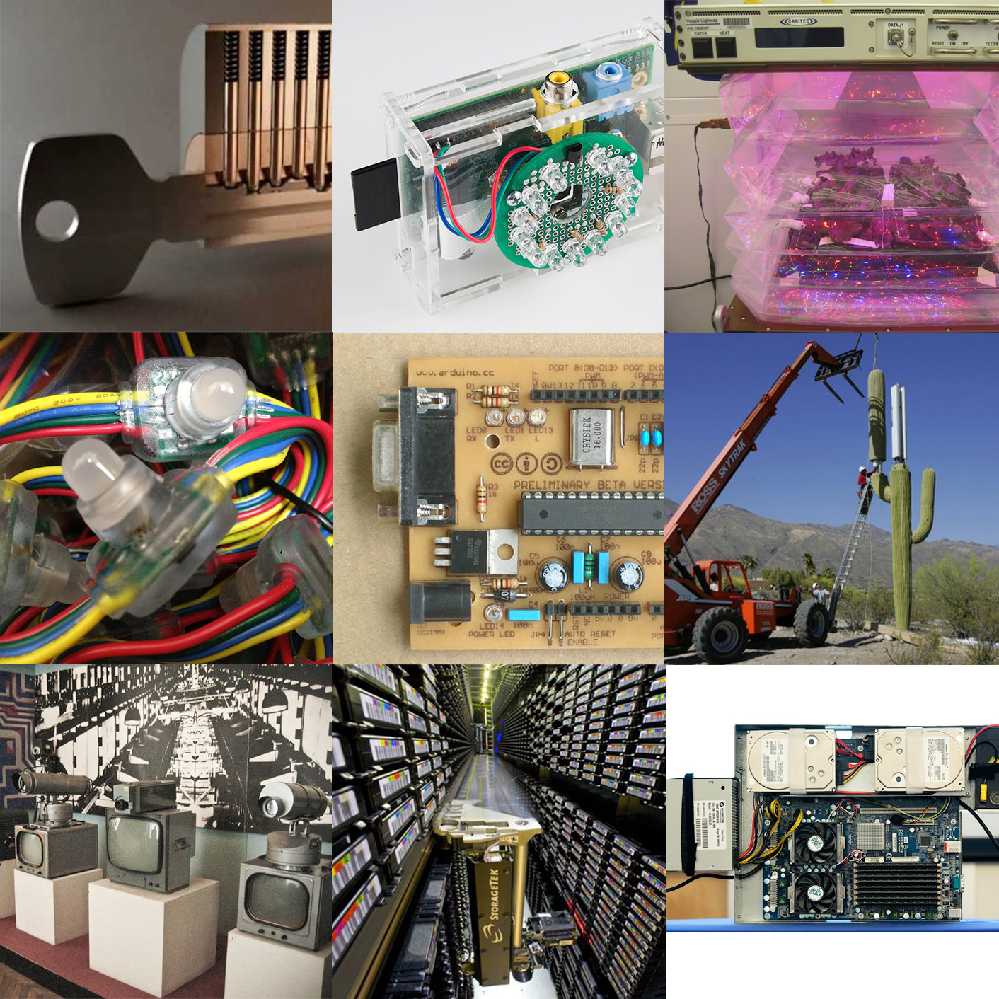

Structure of 2019-20
======================

# Unpacking Intelligent Machines

An introduction to physical computing by hacking everyday objects

## Faculty
Guillem Camprodon and Victor Barberan

## Syllabus & Schedule

We spend our lives interacting with objects and interfaces who’s underlying technology we hardly understand not merely due to their complexity but also because they were intended to be closed by design.

Through the idea of hacking, we will explore the internal components building everyday objects, from coffee machines to wi-fi networks, while learning how to use open software and hardware tools to change the way they work and interface with the world.

We will use tools such as Arduino, Raspberry Pis and Python as an introduction to the work you will later develop during the Fabacademy course.

## Materials

All the electronics materials as development boards, sensors and actuators will be provided during the workshop. However, we hardly encourage those already owning an Arduino Kit, a Raspberry Pi, etc. to bring it.

Bring in your laptop and any prototyping tools you have around such as a cutter, tape, markers, screwdrivers…

Do you have any old appliance at home you would like to take apart? Bring them, too!

## Monday: Forensics of the obsolescence

Tuesday: The right to hack

Wednesday: The cloud that wasn’t

Thursday: Making things talk

Every day from 10-14h and 15-19h (Thursday until 18:30)

## Books
Below is an eclectic list of books that range from technology criticism, design principles towards hand on guides on building hardware and software. We choose them because we love them.

Check the list in Good Reads [Good Reads](https://www.goodreads.com/review/list/70336932-pral2a?utf8=%E2%9C%93&utf8=%E2%9C%93&shelf=mdef-the-way-things-work&view=covers&title=pral2a&sort=rating&order=d&per_page=100)

They are ordered from shorter to longer so you can start with a short reading essay in your busy schedule

Some of the books can be found online for free, use google and archive.org

The Epic Struggle of the Internet of Things, Sterling, Bruce. Strelka Press, 2014 (ISBN 9785906264305) 30 pages. The Politics of Design: A (Not So) Global Design Manual for Visual Communication, Pater, Ruben. BIS Publishers, 2016 (ISBN 9789063694227) 32 pages. The Design of Scarcity, Goodbun, Jon. Strelka Press, 2014 (ISBN ) 44 pages. Thing Explainer: Complicated Stuff in Simple Words, Munroe, Randall. Houghton Mifflin Harcourt, 2015 (ISBN 9780544668256) 64 pages. The Politics of Bitcoin: Software as Right-Wing Extremism, Golumbia, David. Univ Of Minnesota Press, 2016 (ISBN 9781517901806) 100 pages. Society of the Spectacle, Debord, Guy. Rebel Press, 1967 (ISBN 9780946061129) 119 pages. Introduction to Networking: How the Internet Works, Severance, Charles. Charles Severance, 2015 (ISBN ) 122 pages. Getting Started with Arduino, Banzi, Massimo. Maker Media, Inc, 2008 (ISBN 9780596155513) 128 pages. Fifty Dangerous Things (You Should Let Your Children Do), Tulley, Gever. Tinkering Unlimited, 2009 (ISBN 9780984296101) 130 pages. Shaping Things, Sterling, Bruce. Mit Press, 2005 (ISBN 9780262693264) 149 pages. Four Futures: Life After Capitalism, Frase, Peter. Verso, 2015 (ISBN 9781781688137) 150 pages. Operating Manual for Spaceship Earth, Fuller, R. Buckminster. Lars Muller Publishers, 1969 (ISBN 9783037781265) 151 pages. Vehicles: Experiments in Synthetic Psychology, Braitenberg, Valentino. Bradford Book, 1984 (ISBN 9780262521123) 168 pages. Ep, Vol. 2: Design Fiction, Gruijthuijsen, Krist. Sternberg Press, 2019 (ISBN 9783956790485) 170 pages. Platform Capitalism, Srnicek, Nick. Polity, 2016 (ISBN ) 171 pages. Free Software, Free Society: Selected Essays, Stallman, Richard M.. Julian Yap, 2002 (ISBN 9781882114986) 186 pages. Tomas Saraceno: Flying Plaza, Saraceno, Tomás. Spector Books, 2018 (ISBN 9783959050296) 208 pages. Troubleshooting Analog Circuits, Pease, Robert A.. Newnes, 1991 (ISBN 9780750694995) 217 pages. Humankind: Solidarity with Non-Human People, Morton, Timothy. Verso, 2017 (ISBN 9781786631329) 224 pages. Making It: Manufacturing Techniques for Product Design, Lefteri, Chris. Laurence King, 2007 (ISBN 9781856695060) 224 pages. The Message Is Murder: Substrates of Computational Capital, Beller, Jonathan. Pluto Press, 2017 (ISBN 9780745337302) 224 pages. Think Like a Programmer: An Introduction to Creative Problem Solving, Spraul, V. Anton. No Starch Press, 2012 (ISBN 9781593274245) 233 pages. Future Histories: What Ada Lovelace, Tom Paine, and the Paris Commune Can Teach Us About Digital Technology, O’Shea, Lizzie. Verso, 2019 (ISBN ) 240 pages. The Design of Everyday Things, Norman, Donald A.. Basic Books, 1988 (ISBN 9780465067107) 240 pages. Otl Aicher, Rathgeb, Markus. Phaidon Press, 2007 (ISBN 9780714869384) 240 pages. Inventing the Future: Postcapitalism and a World Without Work, Srnicek, Nick. Verso, 2015 (ISBN 9781784780968) 245 pages. Arduino Development Cookbook, Amariei, Cornel. Packt Publishing, 2015 (ISBN ) 246 pages. Wiring the IoT: Connecting Hardware with Raspberry Pi, Node-Red, and MQTT, Rogers, Lucy. O’Reilly Media, 2017 (ISBN 9781491953334) 250 pages. Technology as Magic: The Triumph of the Irrational, Stivers, Richard. Bloomsbury Academic, 1999 (ISBN 9780826413673) 256 pages. Wasting Time on the Internet, Goldsmith, Kenneth. Harper Perennial, 2016 (ISBN 9780062416476) 256 pages. The Hacker Ethic: and the Spirit of the Information Age, Himanen, Pekka. Random House, 1999 (ISBN 9780375505669) 256 pages. The Humane Interface: New Directions for Designing Interactive Systems, Raskin, Jef. Addison-Wesley Professional, 2000 (ISBN 9780201379372) 256 pages. Weapons of Math Destruction: How Big Data Increases Inequality and Threatens Democracy, O’Neil, Cathy. Crown, 2016 (ISBN 9780553418811) 259 pages. The Utopia of Rules: On Technology, Stupidity, and the Secret Joys of Bureaucracy, Graeber, David. Melville House, 2013 (ISBN 9781612193748) 261 pages. Building Blockchain Projects: Building decentralized Blockchain applications with Ethereum and Solidity, Prusty, Narayan. Packt Publishing, 2017 (ISBN ) 268 pages. Unruly Places: Lost Spaces, Secret Cities, and Other Inscrutable Geographies, Bonnett, Alastair. Houghton Mifflin Harcourt, 2014 (ISBN 9780544101579) 270 pages. FAB: The Coming Revolution on Your Desktop–from Personal Computers to Personal Fabrication, Gershenfeld, Neil. Basic Books (AZ), 2005 (ISBN 9780465027453) 278 pages. The Grid: Electrical Infrastructure for a New Era, Bakke, Gretchen. Bloomsbury USA, 2016 (ISBN 9781608196104) 288 pages. Whole Earth Field Guide, Maniaque-Benton, Caroline. Mit Press, 2016 (ISBN 9780262529280) 288 pages. How We Got to Now: Six Innovations That Made the Modern World, Johnson, Steven. Riverhead Books, 2014 (ISBN 9781594632969) 293 pages. La silicolonisation du monde: l’irrésistible expansion du libéralisme numérique, Sadin, Éric. L’Échappée, 2016 (ISBN 9782373090161) 296 pages. Starting Electronics, Brindley, Keith. Newnes, 1994 (ISBN 9780080969923) 296 pages. Present Shock: When Everything Happens Now, Rushkoff, Douglas. Current, 2013 (ISBN 9781591844761) 296 pages. New Dark Age: Technology and the End of the Future, Bridle, James. Verso, 2018 (ISBN ) 304 pages. Hacking Electronics: An Illustrated DIY Guide for Makers and Hobbyists: An Illustrated DIY Guide for Makers and Hobbyists, Monk, Simon. McGraw-Hill/Tab Electronics, 2012 (ISBN 9780071802369) 304 pages. Designing Reality: How to Survive and Thrive in the Third Digital Revolution, Gershenfeld, Neil. Basic Books, 2017 (ISBN 9780465093472) 304 pages. Catching Fire: How Cooking Made Us Human, Wrangham, Richard W.. Basic Books, 2009 (ISBN 9780465013623) 309 pages. How to Diagnose and Fix Everything Electronic, Geier, Michael Jay. McGraw-Hill/Tab Electronics, 2010 (ISBN 9780071744225) 316 pages. Every Tool’s a Hammer: Life Is What You Make It, Savage, Adam. Atria Books, 2019 (ISBN 9781982113490) 320 pages. The Shock of the Anthropocene: The Earth, History and Us, Bonneuil, Christophe. Verso, 2013 (ISBN 9781784780814) 320 pages. Biomimicry: Innovation Inspired by Nature, Benyus, Janine M.. William Morrow Paperbacks, 1997 (ISBN 9780060533229) 320 pages. Mario Bellini, Morteo, Enrico. Phaidon Press, 2015 (ISBN 9780714869452) 320 pages. Cybernetic Revolutionaries: Technology and Politics in Allende’s Chile, Medina, Eden. MIT Press (MA), 2011 (ISBN 9780262016490) 326 pages. The Mushroom at the End of the World: On the Possibility of Life in Capitalist Ruins, Tsing, Anna Lowenhaupt. Princeton University Press, 2015 (ISBN 9780691162751) 331 pages. Capitalism in the Web of Life: Ecology and the Accumulation of Capital, Moore, Jason W.. Verso, 2015 (ISBN 9781781689028) 336 pages. From Counterculture to Cyberculture: Stewart Brand, the Whole Earth Network, and the Rise of Digital Utopianism, Turner, Fred. , 2006 (ISBN 9780226817439) 339 pages. Radical Technologies: The Design of Everyday Life, Greenfield, Adam. Verso, 2017 (ISBN 9781786634498) 340 pages. Making Things Move: DIY Mechanisms for Inventors, Hobbyists, and Artists, Roberts, Dustyn. McGraw-Hill Education Tab, 2010 (ISBN 9780071741675) 350 pages. Beautiful Data: A History of Vision and Reason since 1945, Halpern, Orit. Duke University Press, 2014 (ISBN 9780822357445) 352 pages. SUNBURST and LUMINARY - An Apollo Memoir, Eyles, Don. Fort Point Press, Bostom, 2018 (ISBN 9780986385902) 357 pages. Handmade Electronic Music: The Art of Hardware Hacking, Collins, Nicolas. Routledge, 2006 (ISBN 9780415998734) 360 pages. Fritz Kahn, Debschitz, Uta Von. Taschen, 2009 (ISBN 9783836548403) 360 pages. Free Culture: The Nature and Future of Creativity, Lessig, Lawrence. Penguin Books, 2004 (ISBN 9780143034650) 368 pages. Technology Choice: A Critique of the Appropriate Technology Movement, Willoughby, Kelvin. Intermediate Technology Publications, 1990 (ISBN 9781853390579) 368 pages. Make It So: Interaction Design Lessons From Science Fiction, Shedroff, Nathan. Rosenfeld Media, 2012 (ISBN 9781933820989) 368 pages. Building Open Source Hardware: DIY Manufacturing for Hackers and Makers, Gibb, Alicia. Addison-Wesley Professional, 2014 (ISBN 9780133373905) 368 pages. Quantum Computing Since Democritus, Aaronson, Scott. Cambridge University Press, 2013 (ISBN 9780521199568) 370 pages. The Master Switch: The Rise and Fall of Information Empires, Wu, Tim. Knopf, 2010 (ISBN 9780307269935) 384 pages. Robot in the Garden: Telerobotics and Telepistemology in the Age of the Internet, Goldberg, Ken. Mit Press, 2000 (ISBN 9780262571548) 392 pages. Dieter Rams: As Little Design as Possible, Lovell, Sophie. Phaidon, 2010 (ISBN ) 398 pages. Raspberry Pi Cookbook, Monk, Simon. O’Reilly Media, 2013 (ISBN 9781449365226) 414 pages. To Save Everything, Click Here: The Folly of Technological Solutionism, Morozov, Evgeny. PublicAffairs, 2013 (ISBN 9781610391382) 415 pages. How the Internet Works (How It Works), Gralla, Preston. Que, 1991 (ISBN 9780789736260) 416 pages. We-Think: Mass Innovation, Not Mass Production, Leadbeater, Charles W.. Profile Books(GB), 2009 (ISBN 9781847653895) 423 pages. The Idea Factory: Bell Labs and the Great Age of American Innovation, Gertner, Jon. Penguin Press, 2012 (ISBN 9781594203282) 432 pages. Postmodernism, or, The Cultural Logic of Late Capitalism, Jameson, Fredric. Duke Univ Press, 1991 (ISBN 9780822310907) 438 pages. Adventures in the Anthropocene: A Journey to the Heart of the Planet we Made, Vince, Gaia. Vintage, 2014 (ISBN 9780099572497) 448 pages. Extraordinary Origins of Everyday Things, Panati, Charles. William Morrow Paperbacks, 1987 (ISBN 9780060964191) 463 pages. Fossil Capital: The Rise of Steam Power and the Roots of Global Warming, Malm, Andreas. Verso, 2015 (ISBN 9781784781293) 496 pages. Designing for Emerging Technologies: UX for Genomics, Robotics, and the Internet of Things, Follett, Jonathan. O’Reilly Media, 2014 (ISBN ) 504 pages. The Technological Society, Ellul, Jacques. Vintage, 1954 (ISBN 9780394703909) 512 pages. The Innovators: How a Group of Hackers, Geniuses and Geeks Created the Digital Revolution, Isaacson, Walter. Simon and Schuster, 2014 (ISBN 9781476708690) 542 pages. User Centered System Design: New Perspectives on Human-Computer Interaction, Norman, Donald A.. CRC Press, 1986 (ISBN 9780898598728) 544 pages. Real World Instrumentation with Python: Automated Data Acquisition and Control Systems, Hughes, John M.. O’Reilly Media, 2010 (ISBN 9781449396633) 622 pages. Arduino Cookbook, Margolis, Michael. O’Reilly Media, 2010 (ISBN 9780596802479) 662 pages. Designing Interactions [With CDROM], Moggridge, Bill. MIT Press (MA), 2006 (ISBN 9780262134743) 766 pages. Behave: The Biology of Humans at Our Best and Worst, Sapolsky, Robert M.. Penguin Press, 2017 (ISBN 9781594205071) 790 pages. Practical Electronics for Inventors, Scherz, Paul. McGraw-Hill Companies, 1998 (ISBN 9780071452816) 952 pages. The Art of Electronics, Horowitz, Paul. Cambridge University Press, 1980 (ISBN 9780521370950) 1152 pages.

## Sites
[hackaday.com](https://hackaday.com/) is one of the best blogs on DIY inventions and hardware hacking

[lowtechmagazine.com](https://www.lowtechmagazine.com/) many technology choices are political and economic, looking at past forgotten technologies helps us see the future

[news.ycombinator.com](https://http//news.ycombinator.com) is a social news website focusing on computer science and entrepreneurship.

[archive.fabacademy.org](https://http//news.ycombinator.com) 10 years of project from Fab Labs around the world. Sometimes hard to browse but inspiring!

[learn.adafruit.com](https://learn.adafruit.com/) a really good site for electronics and programming tutorials, especially for beginners

[instructables](https://learn.adafruit.com/) more and more DIY tutorials, sometimes aren’t good but there’s a lot

## Videos
The list will grow during the workshop!

:warning: Warning! Do not try to watch them all! Simply choose a topic you like and jump over the videos. Maybe you find something interesting and suddenly want to learn more about it.

## A brief history of information and computers
- Information Theory

- More on information Theory and Coding (for those who enjoyed the videos above)

- How computers think

- Why we use binary

- How computers work

- How computer memory works the insides

- Colossus the first electronic computer

- How they design the computers they landed astronauts to the moon

- UNIX or what an operative system does

- Looking at how things are built and work to learn how to design

- An introduction to Arduino towards future assignments

## How everyday machines work?
Washing machines, cars, fridges, vacum cleaners…

The Secret Life of Machines
