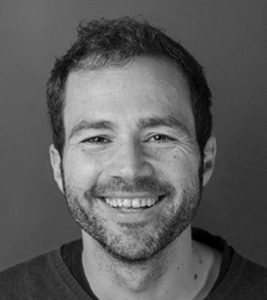

Structure of 2020-21
======================

# MDEF academy Fab Academy

## Track
Application

## Faculty
 Santi Fuentemilla, Eduardo Chamorro, Josep Martí, Óscar González, Victor Barberán

## Syllabus

The Fab Academy is a distributed educational model directed by Neil Gershenfeld of MIT’s Center For Bits and Atoms and based on MIT’s rapid prototyping course, MAS 863: How to Make (Almost) Anything. The Fab Academy began as an outreach project from the CBA, and has since spread to Fab Labs around the world. The program provides advanced digital fabrication instruction for students through a unique, hands-on curriculum and access to technological tools and resources.
During this 6-month program, students learn how to envision, prototype, and document their projects and ideas through many hours of hands-on experience with digital fabrication tools, taking a variety of code formats and turning them into physical objects.

## Santiago Fuentemilla Garriga

Santiago Fuentemilla Garriga (male), with Master of Architecture from the
University of la Salle Universitat Ramon LLull , Spain, as a specialist in
Architectural Design and Construction. In 2012 he graduated from the Fab
Academy Diploma at FabLab BCN, a digital fabrication and rapid prototyping
course directed by Neil Gershenfeld at MIT ́s Center For Bits and Atoms (CBA).
Currently, he is undertaking a PHD in digital fabrication processes at the EGA
UPC (Universitat Politecnica de Catalunya). As a professional Santi has worked in
various architectural firms carrying out projects at the international level in the
last 10 years. He is currently the design director at OPR (Other people’s Rooms)
in Barcelona, a multidisciplinary studio based on architectural concept design for
enhanced user experiences.

Since 2013 he is part of the Fab Lab BCN team, he is the coordinator of the
Future Learning Unit (FLU), the unit focused on the design, implementation and
coordination of active learning experiences with digital manufacturing tools for
the community. FLU designs and promotes educational, innovation and
entrepreneurship projects such as AmbMakers POPUPLAB "Digital Fabrication
Everywhere", FABKIDS, CROCOPOI. FLU participates in European research
projects such as DOIT or DSISCALE and PHALABS 4.0.

Since 2014 he is Fab Instructor of the global academic program Fab Academy
and since 2017 he is professor of the Master in Design for Emergent Futures
MDEF organized by IAAC.

## Eduardo Chamorro Martin

Eduardo Chamorro is an architectural technologist, additive manufacturing expert and researcher, focusing on digital fabrication, materials, robotics and emerging technologies.

He is currently a PhD candidate at Swinburne University (Melbourne, Australia) in High performance composites additive manufacturing for architecture.

Works as faculty and researcher at FabLab Barcelona & IAAC (Institute for Advanced Architecture of Catalonia) in Barcelona, Spain as faculty in the Master in Design for Emergent Futures (MDEF), Master for Advanced Architecture (MAA), Master in Advanced Ecological Buildings (MAEB), 3D Printing in Architecture (3DPA), FabAcademy at IAAC FabLab Barcelona. For him, working in a multi-scalar environment must be the priority of architects nowadays. His research focuses on the implementation of additive manufacturing technologies along different architectural scales imaging multiple processes and materialities.

Eduardo holds a Master's Degree in Architecture from CEU San Pablo University (Spain), a Fab Academy diploma in Digital Fabrication offered by the Fab Lab Network and a Master's Degree in Advanced Architecture from IAAC (Spain), with a specialisation in digital fabrication, materiality novel design methodologies. He holds as well a Spanish architectural licence.

Moreover, he has worked as Fab Lab Seoul director, researcher at several architecture studios, professor of computational design and fabrication at CEU University and advisor for various architecture collectives. He is also a regular collaborator at Fab Lab Madrid. He is always seeking innovative architecture that attempts to solve and adapt to social needs. He has also been a tutor for the Master of Science in Computational and Advanced Design (MSc CAD) at Design Morphine - UACEG (University of Architecture, Civil Engineering and Geodesy).

## Josep Marti Elias

Josep Martí is an Industrial Engineer from Barcelona. Josep started his career as a BI consultant but decided to change his professional path graduating from Fabacademy in 2019. Since then, he has taught digital fabrication, design and electronics in the Fablab, being part of the Future Learning Unit teaching in Fabacademy, Fabricademy and the Master in Design in Emergent futures. Recently, he started his path as a researcher in Erasmus+ projects. He holds a Bachelor’s degree in Industrial Technology Engineering and a Master’s degree in Industrial Engineering, specialising in Automatic Control, both from the Polytechnic University of Catalonia (UPC) and the Fabacademy diploma. He has always been interested in the Maker culture and is always looking to learn and create new things.

## Víctor Barberán Soler

Víctor Barberán is an Industrial Designer with more than 20 years of experience developing custom technology for multidisciplinary art and science projects. Throughout his career, Victor Barberán has worked in electronics design, software development, data analysis, modelling and animation, and digital postproduction. Currently, Victor works as part of the Fab Lab Barcelona as a software and hardware developer in multiple research projects, such as the Smart Citizen project. He is also the Electronics lead for the Fabricademy, Fab Academy and the Masters of Design for Emergent Futures program.

## Óscar González

Óscar González is an Industrial Engineer based in Barcelona with expertise in data analysis, testing and calibration through his experience in automotive and sensor development. Óscar is the Sense Making lead at Fab Lab Barcelona team doing research and development within the Smart Citizen project and is an instructor at the Fabacademy program.
